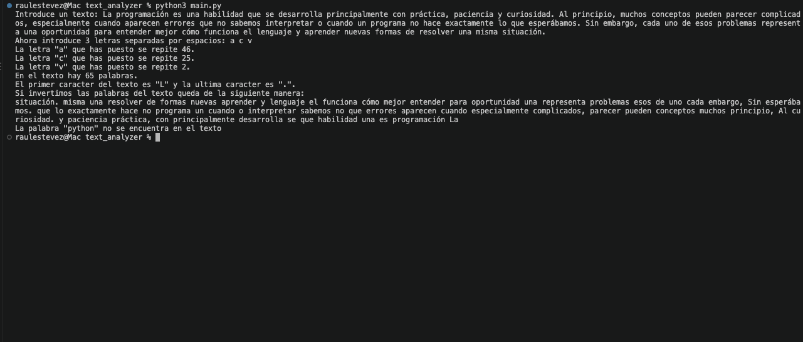

# Analizador de texto

🇬🇧 [Readme en inglés](README.md)

Este repositorio contiene un pequeño analizador de texto para la línea de comandos escrito en Python. Es el proyecto del Día 3 del curso de Federico Garay **Python TOTAL con IA: de CERO a Programador Full en 16 días**.

El objetivo del ejercicio es combinar los conceptos presentados durante los tres primeros días del curso en un programa sencillo y completamente funcional. Por este motivo, la solución utiliza intencionadamente solo el contenido visto hasta ese momento: tipos de datos básicos, strings y sus métodos, listas, diccionarios, booleanos, indexación, slicing y funciones integradas. No utiliza bucles ni sentencias condicionales.

## Cómo funciona el programa

Primero, el programa pide al usuario que introduzca un texto cualquiera, como una frase, un párrafo, un artículo o un poema. Después, solicita exactamente tres letras separadas por espacios.

A partir de estos datos, realiza cinco análisis:

1. **Frecuencia de las letras** - Cuenta cuántas veces aparece en el texto cada una de las tres letras elegidas. La comparación no distingue entre mayúsculas y minúsculas, por lo que ambas versiones de una letra se cuentan juntas.
2. **Número de palabras** - Divide el texto en palabras e indica la cantidad total de palabras.
3. **Primer y último carácter** - Utiliza la indexación de strings para mostrar el primer y el último carácter del texto original.
4. **Orden inverso de las palabras** - Invierte el orden de las palabras y las une en un nuevo string. Los caracteres que forman cada palabra mantienen su orden original.
5. **Comprobación de Python** - Indica si la secuencia de caracteres `python` aparece en alguna parte del texto, independientemente del uso de mayúsculas o minúsculas. Se utiliza un valor booleano como clave de un diccionario para seleccionar el mensaje adecuado sin emplear una sentencia `if`.

## Conceptos practicados

- Lectura de datos introducidos por el usuario mediante `input()`
- Métodos de strings como `lower()`, `count()`, `split()` y `join()`
- Desempaquetado de listas
- Obtención de la longitud de una lista mediante `len()`
- Indexación positiva y negativa
- Slicing con un paso negativo para invertir una lista
- Comprobaciones de pertenencia mediante `in`
- Booleanos y diccionarios
- Strings formateados (f-strings)

## Requisitos

- Python 3
- Ningún paquete de terceros

## Ejecución del programa

Ejecuta el siguiente comando desde el directorio del proyecto:

```bash
python3 main.py
```

Cuando se solicite, introduce un texto que no esté vacío y, después, exactamente tres letras separadas por espacios:

```text
Introduce un texto: Python hace sencillo el análisis de textos
Ahora introduce 3 letras separadas por espacios: a t p
```

Los mensajes y resultados del programa se muestran actualmente en español.

## Captura del programa

<p align="center">
  
</p>

## Suposiciones sobre los datos de entrada

Esta solución de nivel inicial presupone que los datos introducidos son válidos:

- El texto no puede estar vacío porque el programa accede a su primer y último carácter.
- La segunda respuesta debe contener exactamente tres valores separados por espacios para poder desempaquetarlos en tres variables.

La validación de los datos de entrada queda intencionadamente fuera del alcance del ejercicio porque requeriría conceptos no incluidos en los tres primeros días del curso.

## Licencia

Este proyecto está publicado bajo la [Licencia Apache 2.0](LICENSE).

## Contacto

Creado por Raul Estevez.

- Sitio web: [raulesteveza.github.io](https://raulesteveza.github.io)
- LinkedIn: [linkedin.com/in/raulesteveza](https://www.linkedin.com/in/raulesteveza/)
